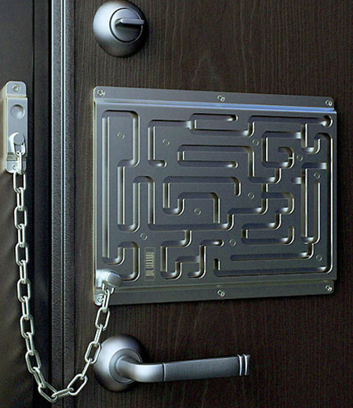

 \* [Graph Paper Napkins](http://design-milk.com/graphkin/). To better help you design a breakthrough on the back of napkin. \* [Defendius Lock System](http://toolmonger.com/2009/04/07/its-just-cool-defendus-lock-system/). Prevents you from going at night when you've had too much. \* [Veneer Toolbox](http://toolmonger.com/2009/04/01/flickr-pool-txinkmans-black-magic/). I'm not handy, so maybe I can just make my tools look awesome. \* [Rollaway bar](http://design-milk.com/sidebard-bar/). Actually I'd use it for gear stowage. \* [Domino Coffee Table](http://design-milk.com/domino-coffee-table/)
