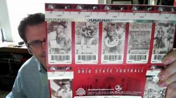

Thank goodness that tickets arrived in the mail today! We can get back to playing football and enjoying the games, and quit focusing on all the activity off the field.

Despite all the offseason turmoil, or maybe because of it, I am actually looking forward to this season quite a bit. There is an uncertainty about OSU this season that has been lacking in recent years. Key positions are major question marks. A new coaching philosophy will be in play. That School Up North has a new staff and some new life. The entry of Nebraska into the league is great news, I would love to get to the OSU/Nebraska game this year. The divisional lineup of the Big10 is a new element. It all adds up to an exciting season.

OSU's home schedule is interesting, tho not great. Nebraska and Michigan are away which is too bad. But Michigan State, Wisconsin, Penn State at home are great games.

No idea which games we are going to get to. Our schedule is very complex this late summer and fall. But hope to see some of you there...
