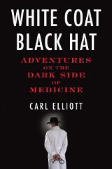

So here at the end of summer, sure it is a beautiful day today, but you know that is only masking the deep corruption all around us. Winter is coming, time to buckle up.

\* "Render Unto Rome: The Secret Life of Money in the Catholic Church":amazon by Jason Berry. I'm not a Catholic but love the idea of peeking inside this institution. Corruption, internal schisms, pedophiles, coverups, and more seem to abound within the church -- the lack of transparency and the lack of justice within church procedures is notable. But I gave up on the book. A) the author clearly has an axe to grind and there is no balance, I am sure there are great people within the church who do a lot of good, and who fight the corruption, but you wouldn't know it by this book. B) the narrative wanders and stumbles and ultimately bores, the author loses track of the point he is trying to make. Amazon says 4.5 stars, "Goodreads says 3":http://www.goodreads.com/book/show/10000761-render-unto-rome, I am 2 stars at most. Maybe if I was Catholic I would find this more fascinating.

\* "White Coat, Black Hat":amazon by Carl Elliott. A very well written anecdotal examination of the money swirling through the healthcare system, largely coming from big pharma. MDs, researchers, research institutions, oversight boards, test subjects, media companies, PR/advertising firms, even bioethicists -- they all have all four feet and their snout in the trough of big pharma, no one is unbiased. Depressing. Trust no one. Amazon says 4.5 stars, "Goodreads says 3.6":http://www.goodreads.com/book/show/8355649-white-coat-black-hat, this is a very good book, 4.5 stars from me. Nothing prescriptive in the book, just a book to get you pissed off. \* Not pissed off enough? Try "Griftopia":amazon by Mat Taibbi. A vicious look at the mortgage/financial meltdown of the last several years, and just how the major financial firms manipulated society and government to screw all of us. Not a balanced work at all, the author is in full attack mode. This sometimes detracts from the tale -- calling Greenspan names, page after page, is wearing and a little sophomoric -- but there is enough meat here to get you really pissed off. I'm putting all our money in chests and burying it, that is the only way to keep it away from the greedy crooks out there. "Goodreads says 4.25 stars":http://www.goodreads.com/book/show/7897556-griftopia, Amazon says 4.5, this is super entertaining, I'd give it a 4.5. \* "How Judges Think":amazon by Richard A. Posner. Only part way through and may give up. I foolishly thought that this book would tell me how judges think. And thus would be a lot of interview-driven, anecdotal stories. However it is a very theoretical discussion of models of how judges behave, and a discussion of what might cause these motivations, written by a judge. All I really get out of this is how one federal judge, the author, thinks. And he seems to be good at splitting fine hairs (not surprising), and that judges are a bit self-important. So I leave modestly frustrated, not really enlightened, and only modestly more cynical about judges. Amazon gives 4.5 stars, "Goodreads":http://www.goodreads.com/book/show/2836459-how-judges-think 3.64, I'd have to say a 3.
