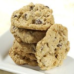

Wondering how recipes associated with classic outdoor occupations stack up? I know I was. 

\* "Ranger cookies":http://www.epicurious.com/recipes/food/views/Ranger-Cookies-106064. Not quite how I remember them as a kid but they have kind of a pecan pie nature to them which is good. \* "Cowboy cookies":http://www.foodnetwork.com/recipes/food-network-challenge/cowboy-cookie-recipe/index.html. Chocolate chips might push this one past the ranger cookie. \* "Shepherd's Pie":http://www.epicurious.com/recipes/food/views/Shepherds-Pie-240224. Tasty but I object to the name "pie", it is just not pie.

Overall I am finding I like the Ranger cookie the best, and maybe they should have chocolate chips added.
