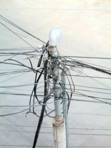

I've got thousands of feet of spare cables. Cat 5, 5e, 6. Coax. Digital audio -- copper and optical. Video with all flavors of DVI, HDMI, and older connectors. S-video. Component. HDMI. USB. FireWire. Audio. Speaker wire. Microphone cables. DMX512. AC power cables of all sorts -- grounded, ungrounded, extension cords. DC power supplies and cables in many varieties.

And bags of converters of all types. Audio. Video. Male-to-female. Female-female. Splitters. Joiners. You name it.

With all these cables and converters, I needed storage solutions just for them. Bins, racks, etc. And I had to keep it all ordered so I could find stuff.

I am throwing it all out. Moving to a JIT system for cables -- I'll buy what i need on the fly. Because having a massive inventory of spares has never saved me a trip to Fry's or a Newegg rush order. I always need the one connector I don't have.
