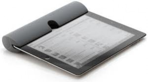

Seems like a nice speaker -- "the Zooka":http://www.kickstarter.com/projects/1733547063/zooka-bluetooth-speaker-for-your-ipad?ref=email -- (though they probably have a trademark issue to resolve) and I'm glad to support a Northwest project. It is also exciting to see the diversity of projects up on Kickstarter, and nice to see that people are willing to pay for value and creativity. After 15 years of people demanding more and more free content and service on the Internet, any shift back towards sustainable business models seems good. Personally I feel way better about paying for something, rather than getting "free" content and having my attention sold to the highest bidder without my involvement and consent.
