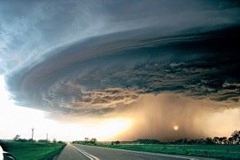

Reasons to hate Kansas. Or at least feel really sorry for them:

\* Tornados. Lots of them.  \* A state so bad, even it's namesake city refuses to be in the state. \* Just like the Wizard of Oz suggests, the entire state is colorless. \* Wikipedia says the name means "people passing wind":http://en.wikipedia.org/wiki/Kansas or something like that \* The first us state to adopt prohibition -- the least fun most humor impaired state ever. \* There is an official state soil. If all you have to celebrate is your dirt, you are one sorry state.

And a joke:

Q. How do you know the toothbrush was invented in Kansas? A. If it was invented anywhere else, it would have been called a teethbrush.
