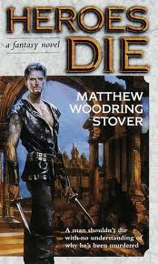

 \* "Heroes Die":amazon by Matthew Woodring Stover. Very very good tale of a future extreme capitalist dystopia and a parallel world used as a source of entertainment. Caine, the protagonist, is an actor caught up in the system, starting to realize how corrupt it all is, and fighting for the respect and love of his partner. Good stuff. \* "Redshirts":amazon by John Scalzi. Cute if you grew up on Star Trek reruns, but not sure it is much beyond that. \* "The Drop":amazon by Michael Connelly. One of his Bosch series of detective novels. Solid, good character, some interesting LA politics, but not groundbreaking. \* "The Dispatcher":amazon by Ryan David Jahn. A 911 dispatcher takes a call, which turns out to be his long missing daughter. And then the thrill ride starts. \* "The Stupidest Angel":amazon by Christopher Moore. I'm not usually a fan of farce but this was pretty fun. A sweet Christmas tale, turns into a "Death at a Funeral"-style romp, and then zombies show up. \* "Wrong Man Running":amazon by Alan Hruska. A man finds himself under suspicion for a series of horrific crimes committed on all the women around him. And since he suffers from frequent blackouts, he may well be guilty. Or not. The main character has some ridiculous blind spots but still entertaining.
