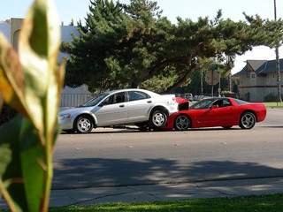

This is a powerful article on "GM's continuing woes":http://www.forbes.com/sites/louiswoodhill/2012/08/15/general-motors-is-headed-for-bankruptcy-again/. The contrast between VW's design-centric culture and GM's culture is stark and telling.

Early in my career I was a (very junior) business strategy consultant and visited GM several times. Even in the 80s the company had a culture problem -- design by committee, too many brand and marketing driven decisions and not enough product driven decisions. And it showed in the cars. Seems like those cultural problems have never been fully fixed -- or they have returned in spades in the new financially-managed GM.

The only GM product I have ever owned was a Chevy truck and I was happy with that, and I'd look at GM truck products again if I was in the market for that kind of vehicle. For any other class of vehicle, I can't imagine looking at a GM product, which is sad.
