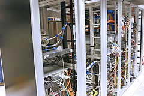

I'm doing some dev work on an ASUS Zenbook running Ubuntu that I am carrying around. I have a Macbook Pro that I carry around for productivity and photography apps. A hand-built WIndows box at home for Steam (tho it has been frightfully long since I played a game). A Raspberry Pi, another ARM sbc, and an Arduino that I am dorking around with. Of course an IPad and a smartphone.

I thank the lucky stars for:

\* Cloud services -- evernote, github, spotify, bitbucket, smugmug, dropbox, skydrive, google reader, twitter, various mail and cal systems -- so that I can get to my content from any of these machines \* USB switches and HDMI switches -- so that I can share keyboards, mice, and displays, or I would be awash in them \* SSH, RDP, and other remote shell/remote desktop solutions -- I would die without them

One tool that doesn't help me much, surprisingly, is good old-fashioned file sharing. I have struggled with getting Windows 7, OSX, and Samba SMB sharing systems to be happy with each other but it is a security and rights morass. I long for the days of password--protected file shares, that would be so much easier in the home.
