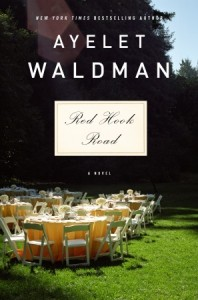
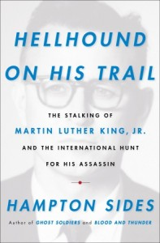

A handful of airplane reads:

\* "Up Against It":amazon by M. J. Locke. YA SF, set in the asteroid belt. Nice technical treatment of asteroid belt life and some interesting political plotting, but tissue paper thin characters for the most part. \* "Red Hook Road":amazon by Ayelet Waldman. In a Maine coastal town, a wedding day turns to tragedy, and the families involved wrestle with that tragedy through the years. For a book that features a horrific tragedy in the first chapter, I found it a little hard to engage, but eventually a couple of the characters hooked me. \* "A Very Simple Crime":amazon by Grant Jerkins. Very quick tale of murder, and since damn near every character is a psychopath or insane or otherwise deeply disturbed, it is hard to sort out who is really guilty. \* "Spiral":amazon by Paul McEuen. Teeny robot drones combined with fungal-based bioweapons! Some fun concepts but the story devolves into the classic madman-taking-over-the-world pattern. Not bad but pretty forgetful. \* "Swordspoint":amazon by Ellen Kushner. An evocative fantasy about a master swordsman and assassin. Nice language but the story itself kind of bored me and I gave up. \* "Before I Go To Sleep":amazon by S. J. Watson. An amnesiac struggles to regain her memories and her life, and slowly realizes that those closest to her may have been using her amnesia for their own ends. Very compelling mystery tale.

And then some meatier choices:

\* "Makers: The New Industrial Revolution":amazon by Chris Anderson. Very nice quick walk through of the maker revolution -- personalities, tools, markets, business models, applications, etc. Enjoyable tho at times a bit overstated. \* "Hellhound On His Trail":amazon by Hampton Sides. The story of last days of Martin Luther King, Jr. and the chase after his assassin. Very good telling of a piece of critical American history. Despite having lived during the time, and having been in DC during some of the riots, my knowledge of the details of the event (and the emotional impact it had on the nation) was very slim.
