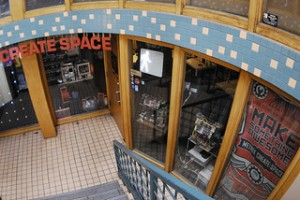

Rich and I had a great evening geeking out at "Metrix Create Space":http://metrixcreatespace.com/ in Capitol Hill last night. We attended the Intro to Arduino class and had a blast wiring things up, playing with the Arduino IDE, and absorbing the maker vibe. I'd love to follow up and take the E-textiles course they have coming up, because that just sounds cool, what could go wrong with electricity and computers embedded in your clothing?

I totally love the maker revolution. My desk right now is covered with Arduinos, sensors, Raspberry Pis, LEDs, and all the other desiderata of modern hobbyist electronics. Awesome stuff.
