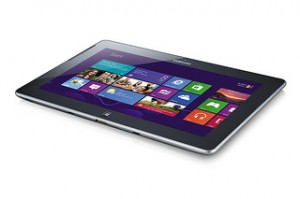

I have the attention span of a gnat, and too large a hardware budget, so of course I ordered a "Surface":http://www.microsoft.com/Surface/en-US day one. I got my Surface on Friday. 64G, black, both the touch and the type covers. My motto -- "Buying first release technology since 1979 so you don't have to!"

There are a million reviews to read of the Surface. I'll be using it over the course of the next several months and will share my thoughts, including these initial views. "Hal Berenson":http://hal2020.com/2012/10/28/understanding-the-microsoft-surface-a-sort-of-review/ is a thoughtful guy and I'd read his notes, he is more positive than I am at this point. So some good balance.

The hardware is solid. A little heavy but feels robust, and I like the width a lot. Having a kb is nice. When you are sitting at a table or desk, the type cover is probably superior. When sitting on the couch with the Surface on your lap, I think the touch cover is a little more functional. As others have said tho, your fingers can easily drift on the touch cover and occasionally you start hitting the wrong keys entirely. It is odd that the kbs have a Fn key, and I have no idea what the Device and Share buttons are for. But good kbs, the Surface delivers on the tablet+keyboard promise.

The Win8 touch interface is fine. Different than iOS but not in a bad way, just different. And some things are very nice -- the live tiles are definitely an improvement over iOS as is the ability to pin objects to the home screen. But...Win8 has oh so many fit and finish issues. Copy and paste is tricky to use. Edit focus jumps around randomly on some screens. Moving the text insertion point is painful. Too many clicks to do common operations. Laggy at times. Config options buried and hard to find -- it took me a long time to figure out how to selectively show a calendar. Dragging to rearrange the home screen is a hit or miss proposition. The whole legacy desktop thing which is particularly useless on an ARM device.

The marketplace is very weak. Lots of brandname apps missing. No Dropbox. No Spotify. No ESPN Scorecenter. No Twitter, Tweetbot, Tweetdeck. There are some offbrand replacements for some of these but many of them are crap, of the two twitter clients I tried, only 1 actually worked, and I have to terminate and restart it regularly. Wordpress app won't work. Feed reader won't work. In MSFT's attempt to fill the store, they have obviously lowered the quality bar. Will this get better? One can hope. It probably depends on how committed MSFT really is to the Surface, and their orphaning of my Nokia Lumia doesn't bode well. This is one reason why I say "wait", MSFT needs to prove they are committed to fixing the marketplace issues (particularly for the ARM devices, I am sure this will be less an issue for Intel-based devices).

The other big selling point of the Surface is Office. Office is just a direct port of the desktop app, with only modest concessions for touch. And the touch support is simply not sufficient -- mapping fat-fingered touches onto a fine resolution mouse interface is not a good experience. Sure you can type, but try creating a slide in PPT with a simple architecture diagram -- some boxes with text and connecting lines. Now do it in Keynote on an iPad. The PPT experience is very trying, the Keynote experience is pretty slick. There are limited changes in Office to embrace the touch screen experience -- you have to touch your way thru a myriad of teeny menu choices, in many cases choosing blind since your finger obscures the choice. Turning on Touch Mode (why is this not on by default?) doesn't help much. Fine movements of the text edit point, fine selections -- all super painful via touch. You find yourself jumping back to the arrow keys on the KB or wishing you had bought a little portable mouse.

As one smart observer said to me, "the Office team bet against Win8" by not doing a native Win8 version. Yes it works but compared to what it could have been, it is completely inadequate. Somehow Apple found the time and engineers to do versions of their productivity apps optimized for OSX and for iOS; Microsoft needs to dig deep and do the same. The current Office apps are adequate viewers of content, but I will never use these for any intensive content creation -- and they drag along the whole confusing legacy desktop mode, which is pointless on an ARM-based device. Office delivers limited value on these devices, I would wait until MSFT delivers real Win8 versions of the apps. (BTW, I've heard some complaints that MSFT didn't port Outlook. Well I say thank goodness, the Surface Mail and Calendar apps are native Win8 apps and are usable. If I had to use desktop Outlook, that would be bad.)

So: keyboards good, Windows8 looks nice but needs polish, office pointless, marketplace weak. I'd wait to buy, and I'd look hard at other Win8 options.

Different views?
