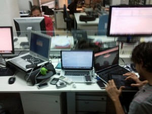

Overall the Surface is, well, a turd. It is a crappy cheap laptop. Or maybe an ok-but-expensive tablet, although completely lacking the tablet apps I want.

But it has forced me to think about the gear I carry. Right now my bag contains a laptop (MacBook pro or ASUS ultra book depending on the day), an iPad 3, and a Kindle Touch. And now the Surface is trying to push its way in there. Oh and my phone is always in my pocket. What do I really need?

The principles I think are this:

\* All data is going to synced with the cloud all the time, and will be available with native clients on every relevant platform, so using multiple devices is a fine experience \* All devices are going to get lighter, cheaper, with greater power and battery life. Carrying around a couple won't be a problem weight-wise or economically. \* Device design will be optimized for the way it is used -- consumption, creation, etc.

I'm always going to have a phone. Pocket sized, 1 day battery, great voice/text, decent apps and web. No need for it to bloat up in size, I've got other bigger devices with me, and I want it in my pocket, and it just has to be great at texting and talking.

I also need a great content creation device. A 13-15" screen with a great keyboard (the Surface keyboard is too compromised), in a stiff shell so that the keyboard works well (the Surface has taught me the value of a stiff shell). Today this is a MacBook Air or Ultrabook, these will just get better and lighter.

And then I need a great browsing and consumption device for web, video, games, etc. The current iPad is great but is just a little too big. I'm betting the market moves to the 7" tablet form factor, the iPad Mini/Kindle/Nexus. Fits in a hand, great for reading or video or web or games, great battery life. Smarter people than me are betting on this move as well -- see for instance the "Daring Fireball":http://daringfireball.net/2012/10/ipad\_mini view on the iPad mini. This knocks the current iPad and Kindle out of my bag (though I do love the passive display on the Kindle, so maybe I still carry the smallest Kindle around).

This set of gadgets would be substantially lighter and more compact than what I carry today, and would hit all my needs, and isn't that much to carry around. An implication: Tweener devices make no sense. Phablets? Surface? Eh. You'll just carry a best of breed 7" tablet and a laptop. The tweeners are economic compromises -- cheaper than carrying two devices -- but over time, the prices on all these gadgets continue to drop, the economic argument is a loser long run. And tweener devices are always design compromises -- never great at either scenario, no matter how much work engineering goes into the transforming bridge work.
