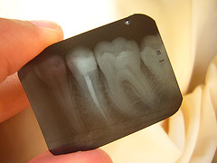

This guide to [booting ubuntu on uefi hardware](https://help.ubuntu.com/community/UEFI) leaves me lost. I never thought I would pine for the days of the good old BIOS. Maybe I should go to the [UEFI Summerfest](http://www.uefi.org/home/), that sounds like a good time. Right up there with the "Root Canal Faire" and "Proctology Midnight Madness".
