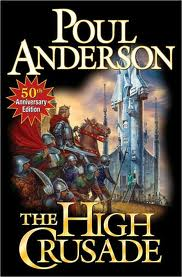

- [Traitor to His Class](http://www.amazon.com/Traitor-His-Class-Privileged-ebook/dp/B001ANYDJ0/ref=sr_1_1?s=books&ie=UTF8&qid=1368366369&sr=1-1&keywords=traitor+to+his+class "Traitor to His Class") by H. W. Brands. A fine biography of FDR. The title led me to believe that it would be a little more focused on the conflict between his policies and the monied elite, but it was really a general biography of the most influential president of the last century.
- [The Stranger's Child](http://www.amazon.com/The-Strangers-Child-Vintage-International/dp/0307474348/ref=sr_1_1?ie=UTF8&qid=1370352238&sr=8-1&keywords=the+stranger%27s+child) by Alan Hollinghurst. Snooty acclaim but I am giving up. The "oh my gosh they were secretly gay" idea just doesn't do it for me anymore, you can't carry a story on this point, it's like trying to revolve a story around "he was secretly left-handed!". Maybe 30 years ago this would have been interesting. Not now.
- [Maske: Thaery](http://www.amazon.com/Maske-Thaery-Jack-Vance/dp/0743475240/ref=sr_1_1?ie=UTF8&qid=1370352290&sr=8-1&keywords=maske+thaery) by Jack Vance. Classic 70's science fiction, some sort of Vance appreciation society is pulling these out of the back catalog and getting them out in e-book form. His characters seem stilted and awkward, age hasn't treated them well, and yet a compelling tale.
- [The 5th Wave](http://www.amazon.com/The-5th-Wave-Rick-Yancey/dp/0399162410/ref=sr_1_1?ie=UTF8&qid=1370352338&sr=8-1&keywords=the+5th+wave) by Rick Yancey. Beginning of a YA series about an alien invasion of Earth, appealing due to the shades of gray in the characters. I'd read more.
- [Lucky Jim](http://www.amazon.com/Lucky-York-Review-Books-Classics/dp/1590175751/ref=sr_1_1?ie=UTF8&qid=1370352374&sr=8-1&keywords=lucky+jim) by Kingsley Amis. Eh. An over-ambitious grasper stumbles his way to success. The character is unappealing and I just don't get him. Supposed to be funny.
- [The High Crusade](http://www.amazon.com/The-High-Crusade-Poul-Anderson/dp/1439133778/ref=sr_1_1?ie=UTF8&qid=1370352462&sr=8-1&keywords=the+high+crusade) by Poul Anderson. What a great fun book, a piece of classic science fiction that has aged very well. A blast.
- [Steal Across the Sky](http://www.amazon.com/Steal-Across-Sky-Nancy-Kress/dp/0765359561/ref=sr_1_1?ie=UTF8&qid=1370352600&sr=8-1&keywords=steal+across+the+sky) by Nancy Kress. A nice concept but the story doesn't go particularly anywhere.
