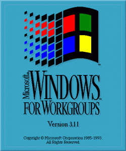

Apparently [Linux 3.11 has been named Linux for Workgroups](http://git.kernel.org/cgit/linux/kernel/git/torvalds/linux.git/commit/?id=ad81f0545ef01ea651886dddac4bef6cec930092). How awesome, even if it is not really meant in tribute.

This was the first shipping product I worked on at Microsoft. A great great team of people. I remember how surprised we all were on the product team when the product was marketed at launch as a "Notes Killer". We were just trying to make networking work within Windows, because up to that point, networking install for Windows was a ball buster.

I still have a WFW screwdriver.
