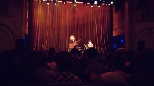
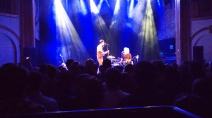

First time at the [Neptune](http://www.stgpresents.org/neptune), nice small venue, plenty of parking nearby. The acoustics aren't awesome but a great place to see a band.

And [Shovels & Rope](http://www.shovelsandrope.com/) blew the f$%king doors off the place. They were loud and had great energy. Love their songwriting and their stage presence and interplay. We first became hooked on them based on [this video](http://www.youtube.com/watch?v=8nElVTkXmLo) which is an utterly intoxicating performance, and captures their presence. But wow they kick up the volume and energy for most of their live show, it was very much a rock and roll show. [Tickin Bomb](http://www.youtube.com/watch?v=7dhKoNXp-9M) and [Shank Hill Street](http://www.youtube.com/watch?v=NBJGTOycVxU) were both excellent with the added energy and volume, the guitar work was awesome. A super talented duo, so glad to have seen them.
