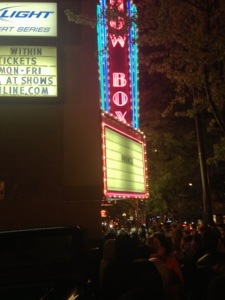

Great show last night, I feel very fortunate to have seen Prince in a small venue. A rocking show -- just his current small backing band of 3 women on drums, bass, and guitar. Opened with a few classics, including a nice variant on "I Could Never Take The Place of Your Man". A lot of his new material. A nice cover of the Cars' "Let's Go" with a shout out to Boston. A really nice cover of "Crimson and Clover". Along the way Prince was in great lead guitar form, and also picked up the bass at one point for a great solo.

He is a captivating performer. I've seen Jack White in a small venue and Buddy Guy, they both pour a lot of emotion into their guitar work, Prince is up there as well.
