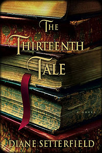

- [The Hidden](http://www.amazon.com/Hidden-Tobias-Hill-ebook/dp/B002QHATL0) by Tobias Hill. An amazon review mentions "style without substance" and that seems dead on. A moody setting and some interesting construction, but a really boring book.
- [Heaven's Shadow](http://www.amazon.com/Heavens-Shadow-David-S-Goyer/dp/1937007642) by David Goyer and Michael Cassutt. Probably should just re-read Rendezvous with Rama.
- [The Thirteenth Tale](http://www.amazon.com/Thirteenth-Tale-Novel-Diane-Setterfield/dp/0743298039) by Diane Setterfield. A biographer uncovers an unexpected tale, and resolves issues in her own life. A good tale, possibly the ugliest cover art ever tho.
- The Hare With The Amber Eyes by Edmund de Waal. A family history as told thru their ownership of Japanese netsuke. Strangely compelling. The author's rationalization of his family's ownership of these netsuke in contrast to his justified outrage about the appropriate of his family's property during WWII is a little hard to accept.
