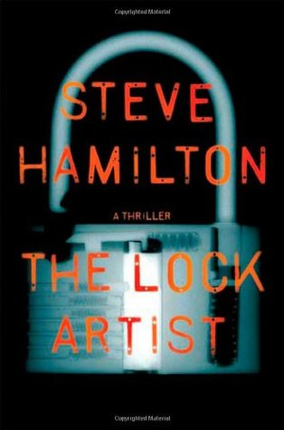

- [The Lock Artist](http://www.amazon.com/Lock-Artist-Novel-Steve-Hamilton-ebook/dp/B002ZW7EBE) by Steve Hamilton. Fantastic story of a young man struggling with a turbulent life, a turbulent background, and his really unique attributes. Really enjoyed.
- [The Good Lord Bird](http://www.amazon.com/Good-Lord-Bird-James-McBride-ebook/dp/B00AEDDPU0) by James McBride. The story of the abolitionist John Brown told from inside his troop. Engaging and depressing and uplifting.
- [Daughter of Smoke and Bone](http://www.amazon.com/Daughter-Smoke-Bone-Trilogy-Book-ebook/dp/B004QX076Y) by Laini Taylor. The coming of age of a young art student who realizes that she and her family are actually something quite unnatural and important. This is well travelled road, but a solid tale nonetheless.
- [An Incomplete Revenge](http://www.amazon.com/Incomplete-Revenge-Maisie-Dobbs-Mysteries-ebook/dp/B000UZQIVK) by Jacqueline Winspear. Solid English countryside mystery. Totally enjoyable if you are into that kind of thing (which I am). Apparently many more in the series.
