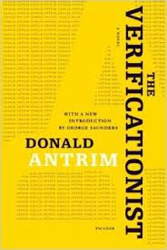

Truth, from [The Verificationist](http://www.amazon.com/Verificationist-Novel-Donald-Antrim/dp/0312662149), by Donald Antrim:

> We eat pancakes to escape loneliness, yet within moments we want nothing more than our freedom from ever having so much as thought about pancakes. Nothing can prevent us, after eating pancakes, from feeling the most awful regret. After eating pancakes, our great mission in life becomes the repudiation of the pancakes and everything served along with them, the bacon and the syrup and the sausage and coffee and jellies and jams. But these things are beneath mention, compared with the pancakes themselves. It is the pancake—Pancakes! Pancakes!—that we never learn to respect. We promise ourselves that we will know better, next time, than to order pancakes in any size or in any amount. Never again will we be tempted by buckwheat or buttermilk or blueberry flapjacks. However, we fail to learn; and the days go by, two or three weeks pass, then a month, and we forget about pancakes and their dominion over us. Eventually, we need them. We crawl back to pancakes again and again.
