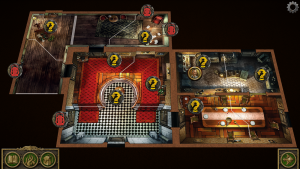

[Mansions of Madness](https://www.amazon.com/Mansions-Madness-Board-Game-2nd/dp/B01J4NB6CO) was surprisingly fun.  We had low expectations, it just didn't look like our kind of game.  Cooperative sounded too nice. But the pace is good, the iPad app really helped run the game, and once we realized that going "insane" in the game opened up play quite a bit, we had a lot of fun.  Definitely recommended.  Not a short game tho.

[King of Tokyo](https://www.amazon.com/King-Tokyo-New-Board-Game/dp/B01F46RPS4) -- super fast to play, easy gameplay, and the game can shift dramatically in seconds.  Also recommended, and you can fly through a game.

A disappointment was [One Night Werewolf](https://www.amazon.com/Bezier-Games-ONUWBEZ-Ultimate-Werewolf/dp/B00HS7GG5G).  Maybe we needed more eggnog.  With 5 people, it seemed like the outcomes were obvious.  Maybe we were doing it wrong.
