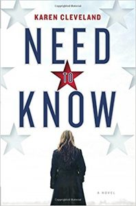

- [Scoreboard, Baby](https://www.amazon.com/Scoreboard-Baby-College-Football-Complicity-ebook/dp/B004D4Z6IK) by Ken Armstrong & Nick Perry. The inside story on the UW football team in the early 2000s, pretty shocking and awful.  I am sure this level of corruption has happened at other programs too.
- [Red Rising](https://www.amazon.com/Red-Rising-Pierce-Brown/dp/034553980X) by Pierce Brown.  Start of a series set in the far future of our solar system. All the near habitable planets and moons are terraformed, a rigid authoritarian society is in place, and an uprising starts at the lowest levels of Martian society.  Fun.
- [Need To Know](https://www.amazon.com/Need-Know-Novel-Karen-Cleveland-ebook/dp/B07257N5WW) by Karen Cleveland.  A LOT of fun.  A CIA analyst discovers her husband might be a Russian mole, and things get complicated as she tries to protect her life while more and more of the onion gets peeled away.
- [The Humans](https://www.amazon.com/Humans-Novel-Matt-Haig-ebook/dp/B00A27X972) by Matt Haig.  A scientist makes a mathematical breakthrough which will transform our society, triggering the arrival of aliens who decide that humans aren't ready for this knowledge.
- [Broken River](https://www.amazon.com/Broken-River-J-Robert-Lennon-ebook/dp/B01LXT22WY) by J. Robert Lennon.  Crimes and misdeeds swirl around a house in upstate New York.  Eventually pretty much everyone is threatened with death or is dead.  Fun!
- [Introducing Go](https://www.amazon.com/Introducing-Go-Reliable-Scalable-Programs/dp/1491941952) by Caleb Doxsey.  Very short intro to golang.  A bit thin.
