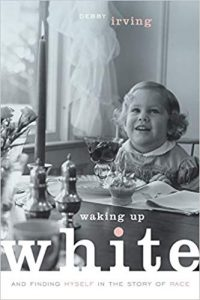

- [Waking Up White](https://www.amazon.com/Waking-Up-White-Finding-Myself-ebook/dp/B00HZZ1JD0) by Debby Irving.  A lot to process in this book.  I am probably just a few steps along the path to really understanding race in the US and my own role in the issues.  This is definitely worth reading and thinking about.
- [Beyond the Pale](https://www.amazon.com/Beyond-Pale-World-Spies-Mystery-ebook/dp/B075W2V7GP) by Clare O'Donahue.  Pleasant little detective jaunt set mostly in Ireland.  An appealing couple of main characters.  The MacGuffin is a little forced, but the chase for it has some fun parts.
- [Light Years](https://www.amazon.com/Light-Years-Vintage-International-Salter-ebook/dp/B004G8PIOA) by James Salter.  A bit of a throwback, and oh so nicely written -- very very smooth.  Makes the above modern texts seem clunky.
- [How It Happened](https://www.amazon.com/How-Happened-Michael-Koryta-ebook/dp/B075CRZZRC) by Michael Koryta.  Solid thriller set in coastal Maine -- murders, drugs, tawdry secrets.  Engaging
- [Artificial Condition](https://www.amazon.com/Artificial-Condition-Murderbot-Martha-Wells-ebook/dp/B075DGHHQL) by Martha Wells.  Gosh this MurderBot series is fun.  I want a wisecracking sidekick murderous robot.
