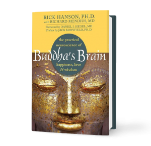

- [Aware](https://www.amazon.com/Aware-Practice-Presence-Groundbreaking-Meditation-ebook/dp/B077RF7Z6V) by Daniel J. Siegel.  A recommended text on meditation, but too much handwavey pseudo science for me.  Did not find worthwhile at all, rather found it annoying.
- [Buddha's Brain](https://www.amazon.com/Buddhas-Brain-Practical-Neuroscience-Happiness-ebook/dp/B003TU29WU) by Rick Hanson.  Another text on meditation, way better with much more underpinning and solid practical guidance.  And there is an app!
- [Missing, Presumed](https://www.amazon.com/Missing-Presumed-Novel-Manon-Bradshaw-ebook/dp/B0165I3V06) by Susie Steiner.  Excellent start to a detective series, central character is mid-career detective in London with a complex and messy personal life, embroiled in a high profile missing persons case.  Very good.
- [Our Little Secret](https://www.amazon.com/Our-Little-Secret-Roz-Nay-ebook/dp/B0763TB8W1) by Roz Nay.  Ooh a dark little tale about obsession, betrayal.  Nicely structured.
