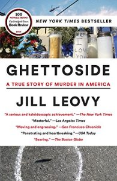

- [Ghettoside](https://www.amazon.com/Ghettoside-True-Story-Murder-America/dp/0385529996) by Jill Leovy.  In depth story about homicides in the poorer parts of LA.  The author makes the strong case that the high rate of crime is a consequence of poverty and lack of strong government, not surprising.   At times a very sad story.
- [Rogue Protocol](https://www.amazon.com/Rogue-Protocol-Murderbot-Martha-Wells-ebook/dp/B0756JSWGL) and [Exit Strategy](https://www.amazon.com/gp/product/B078X1N8VF) by Martha Wells.  Last two books of the Murderbot series, I just love this character.   An inhuman killing machine with a heart of gold and more humanity than most humans.
- [The Gone World](https://www.amazon.com/Gone-World-Tom-Sweterlitsch-ebook/dp/B0722TJN5P) by Tom Sweterlisch.  Very inventive, humans travel to the stars and the near future and back -- and something horrible comes back with them.
- [The Darkest Secret](https://www.amazon.com/Darkest-Secret-Novel-Alex-Marwood-ebook/dp/B0191ZL2LK) by Alex Marwood.  A missing child case turns much darker as her sibling uncovers ugly secrets years later.  Fun.
