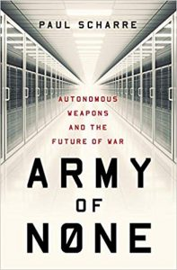

- [A Darkling Sea](https://www.amazon.com/Darkling-Sea-James-L-Cambias-ebook/dp/B00FO6HV20/) by James L. Cambias.  Ugh, how did this thing get decent reviews?  Reads like Asimov from early 70s which I enjoyed when I was 12 but hasn't aged well.
- [The Guest Room](https://www.amazon.com/Guest-Room-Vintage-Contemporaries/dp/0804170983) by Chris Bohjalian.  Sad story about human trafficking and its victims, wrapped up inside a suspense novel.  A little uncomfortable at times, human trafficking is an ugly business.
- [Bring Me Back](https://www.amazon.com/Bring-Me-Back-B-Paris/dp/1250151333) by B. A. Paris.  Marketed as a great beach read, at first I thought this was an engaging tale, and then I realized that the two protagonists are possibly the two stupidest people I have ever encountered in a novel.  Abandoned.
- [Army of None](https://www.amazon.com/Army-None-Autonomous-Weapons-Future/dp/0393608980) by Paul Scharre,  An examination of the issues around autonomous weapons.  Mixed feelings.  Some of the writing is very clumsy, but the discussion of the human/weapons systems integration issues are interesting.
- [How Fascism Works](https://www.amazon.com/How-Fascism-Works-Politics-Them/dp/0525511830) by Jason Stanley.  A catalog of the mechanics of fascism (and an examination of how they are being used today).  Depressing.
