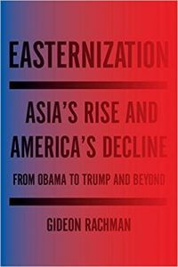

- [The Dry](https://www.amazon.com/Dry-Novel-Jane-Harper-ebook/dp/B01BSN15F6) by Jane Harper. A breathless page turner according to the reviews -- i did consume in about 2 days. Very solid tale set in rural Australia -- murder, money, long-hidden secrets.
- [Easternization](https://www.amazon.com/Easternization-Asias-Americas-Decline-Beyond-ebook/dp/B01I85OO00) by Gideon Rachman.  A good summary of the rise of China and the impact on US domestic and foreign policy.  There is no getting around the fact that China's economy and hence soft power and military power is going to surpass that of the US, it is simple numbers.  And much about that is OK, China becoming richer is no real threat to us and no real threat to world peace.  That said, there might be some issues that the US differs from China on, and if the US wants a strategy to counter China, we need to focus on multilateral partnerships in Asia and/or Europe and/or the Americas.  We are doing a poor job at that.
- [A Higher Loyalty](https://www.amazon.com/Higher-Loyalty-Truth-Lies-Leadership-ebook/dp/B074J6F41V) by James Comey.  Some of you may have heard of this book.  Comey seems very principled.  He doesn't like Trump and writes a compelling indictment.  I believe he fails tho to really understand his missteps around the election.  Every decision he made was a principled local optimum but globally was an asymmetric skew.  And he doesn't go to the meta level and discuss how the FBI should behave in the future.  We can take it as a given that both major candidates in the future will have various accusations made against them, and the FBI should probably simply announce that they are investigating both candidates and be transparent about the nature of the charges against them.
